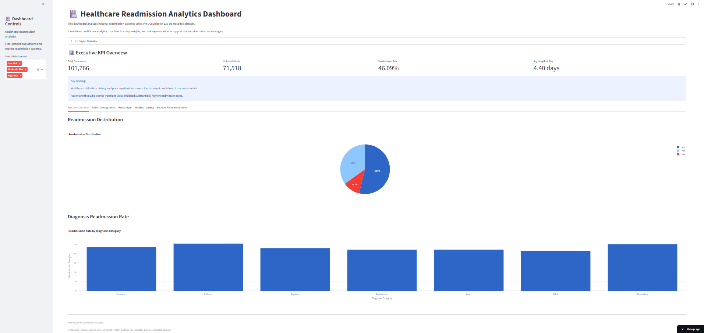
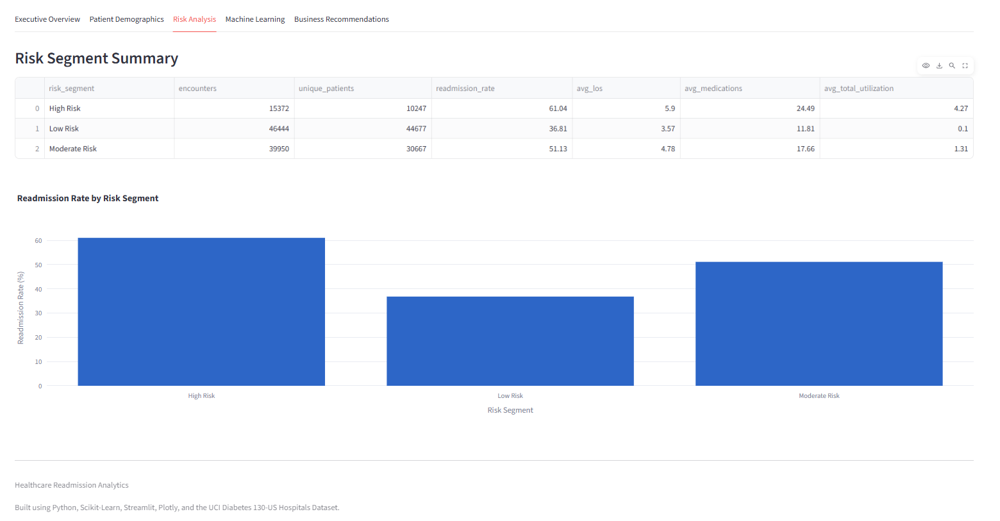
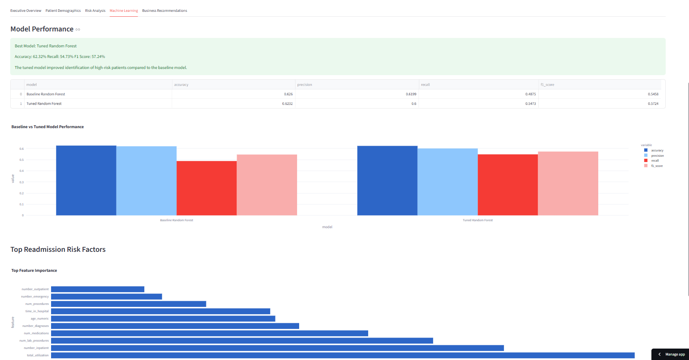
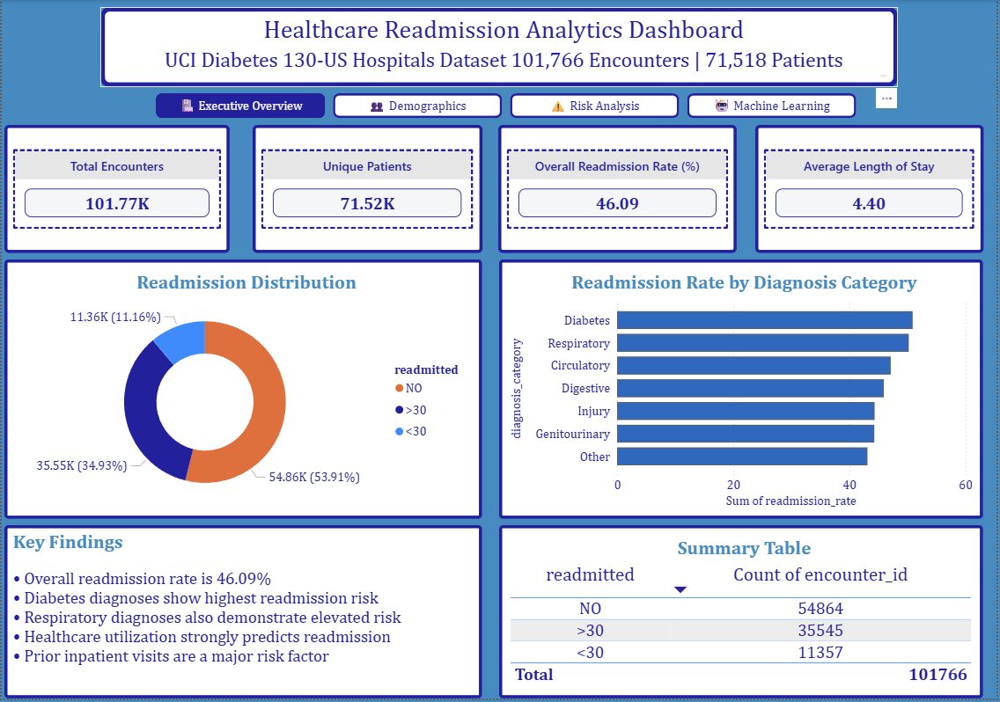
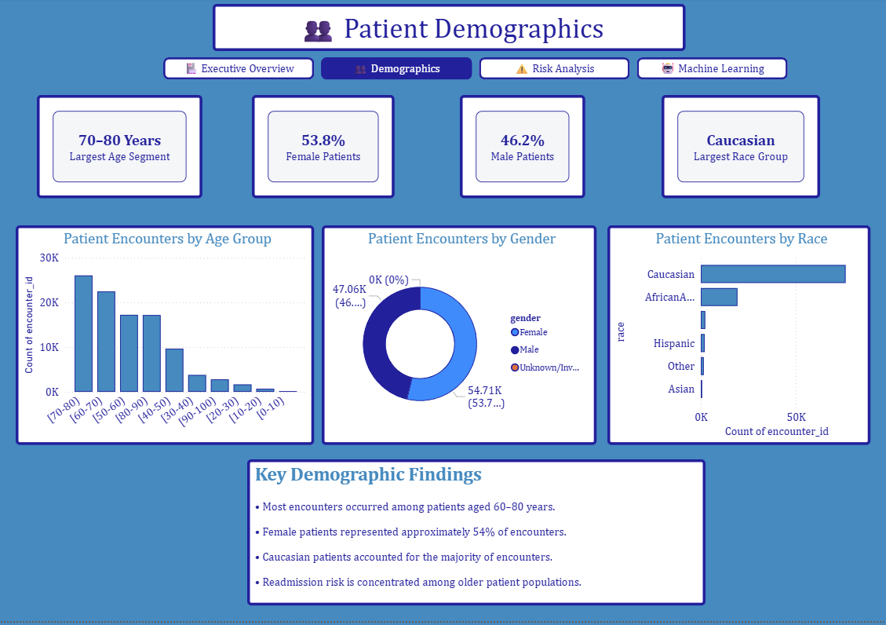
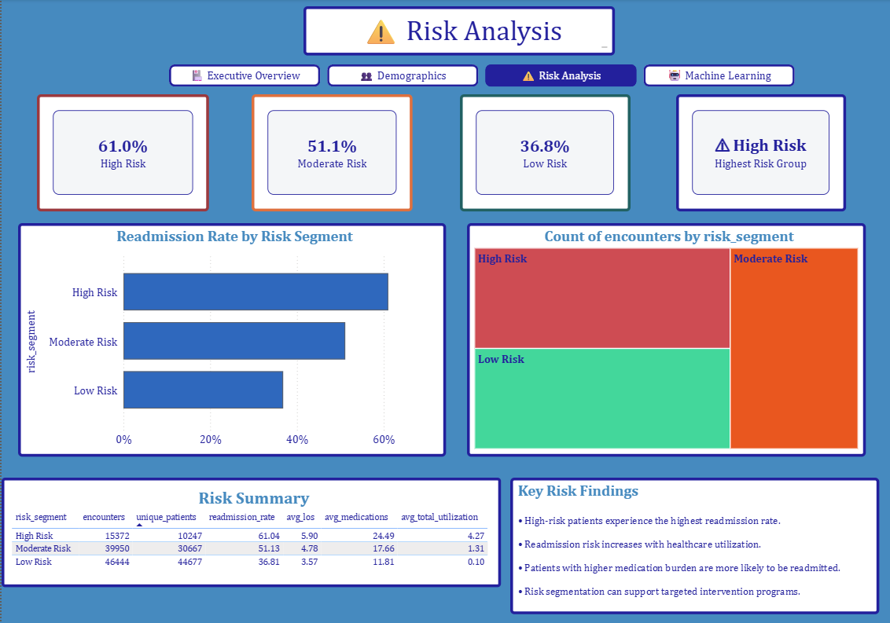
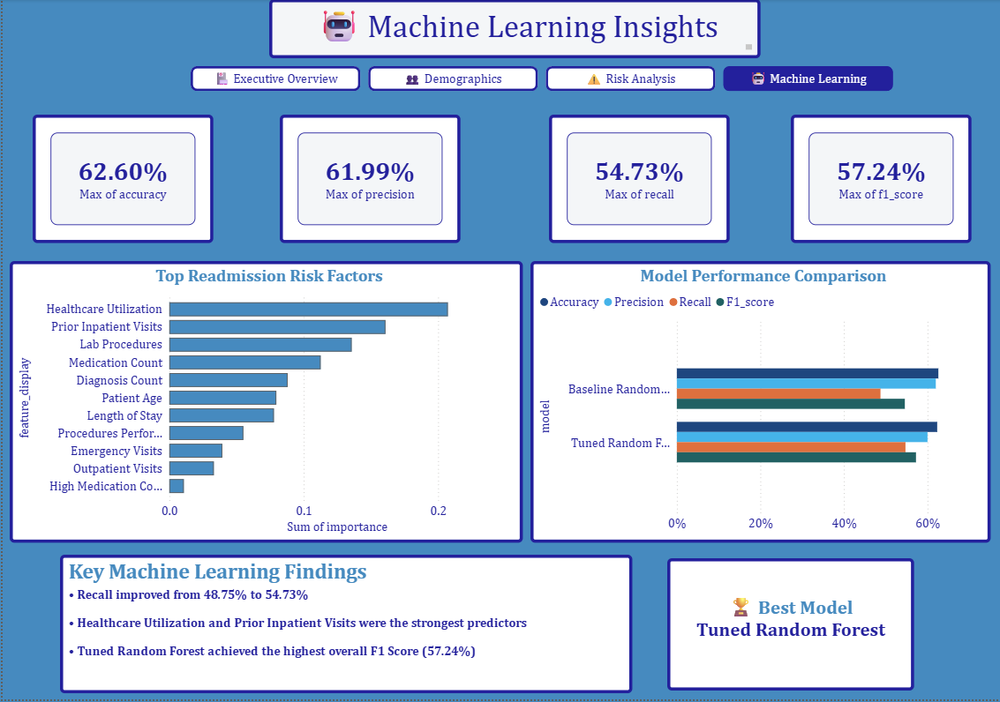

# Healthcare Readmission Analytics

## Predicting Hospital Readmissions Using Healthcare Analytics, Machine Learning, Streamlit & Power BI

### Live Dashboard

[View Live Streamlit Dashboard] https://healthcare-readmission-analytics-dashboard.streamlit.app/

### GitHub Repository

[View GitHub Repository] https://github.com/HumsShaik/healthcare-readmission-analytics

---

# Project Overview

Hospital readmissions are a major challenge in healthcare systems worldwide. Frequent readmissions increase healthcare costs, reduce resource availability, and may indicate gaps in patient care.

This project analyzes over **100,000 hospital encounters** from the UCI Diabetes 130-US Hospitals dataset to identify factors associated with patient readmissions and develop predictive models that can help healthcare organizations proactively identify high-risk patients.

The project combines:

- Healthcare Analytics
- Exploratory Data Analysis (EDA)
- Risk Segmentation
- Machine Learning
- Interactive Streamlit Dashboard
- Power BI Executive Dashboard

---

# Business Problem

Hospital administrators need to understand:

- Which patients are most likely to be readmitted
- What factors contribute to readmission risk
- How healthcare utilization impacts future hospitalizations
- Which patient populations require targeted intervention

The objective of this project is to transform raw healthcare data into actionable insights that support readmission reduction strategies.

---

# Dataset

**Source:** UCI Machine Learning Repository

**Dataset:** Diabetes 130-US Hospitals for Years 1999–2008

### Dataset Characteristics

| Metric | Value |
|----------|----------:|
| Hospital Encounters | 101,766 |
| Unique Patients | 71,518 |
| Features | 50 |
| Years Covered | 1999–2008 |
| Target Variable | Readmission Status |

---

# Project Objectives

- Analyze hospital readmission patterns
- Identify demographic and clinical risk factors
- Build predictive machine learning models
- Segment patients into risk categories
- Develop executive-level dashboards
- Generate business recommendations

---

# Technology Stack

## Programming

- Python

## Data Analysis

- Pandas
- NumPy

## Visualization

- Matplotlib
- Seaborn
- Plotly

## Machine Learning

- Scikit-Learn

## Dashboarding

- Streamlit
- Power BI

## Version Control

- Git
- GitHub

---

# Project Workflow

```text
Data Understanding
        ↓
Data Cleaning
        ↓
Exploratory Analysis
        ↓
Feature Engineering
        ↓
Machine Learning
        ↓
Model Tuning
        ↓
Business Recommendations
        ↓
Streamlit Dashboard
        ↓
Power BI Dashboard
```

---

# Project Structure

```text
healthcare-readmission-analytics/

│
├── data
│   ├── raw
│   └── processed
│
├── notebooks
│   ├── 01_data_understanding.ipynb
│   ├── 02_data_cleaning.ipynb
│   ├── 03_exploratory_analysis.ipynb
│   ├── 04_feature_engineering.ipynb
│   ├── 05_baseline_modeling.ipynb
│   ├── 06_model_improvement_tuning.ipynb
│   └── 07_model_interpretation_business_summary.ipynb
│
├── dashboard
│   └── app.py
│
├── outputs
│   ├── executive_kpis.csv
│   ├── risk_segment_summary.csv
│   ├── final_feature_importance.csv
│   ├── tuned_model_comparison.csv
│   └── final_model_predictions.csv
│
├── powerbi
│   └── Healthcare Readmission Analytics.pbix
│
├── images
│
├── requirements.txt
│
└── README.md
```

---

# Exploratory Data Analysis Highlights

## Readmission Distribution

| Category | Percentage |
|-----------|----------:|
| No Readmission | 53.91% |
| Readmitted | 46.09% |

---

## Demographic Insights

### Age Groups

Most hospital encounters occurred among:

- 70–80 years
- 60–70 years
- 80–90 years

### Gender Distribution

| Gender | Percentage |
|----------|----------:|
| Female | 53.7% |
| Male | 46.3% |

### Race Distribution

Most encounters involved:

- Caucasian Patients
- African American Patients

---

# Key Healthcare Insights

## Previous Inpatient Visits Increase Readmission Risk

| Previous Inpatient Visits | Readmission Rate |
|----------|----------:|
| 0 | 38.5% |
| 1 | 54.8% |
| 2 | 64.9% |
| 3 | 69.7% |
| 4 | 74.2% |
| 5 | 80.0% |

### Insight

Patients with prior inpatient visits exhibit substantially higher readmission rates.

---

## Diagnosis Categories With Highest Risk

| Diagnosis Category | Readmission Rate |
|----------|----------:|
| Diabetes | 50.87% |
| Respiratory | 50.22% |
| Circulatory | 47.11% |

### Insight

Patients diagnosed with diabetes and respiratory conditions represent key intervention populations.

---

## Medication Complexity

Readmission rates increased as medication count increased.

### Insight

Medication burden may contribute to treatment complexity and readmission risk.

---

# Feature Engineering

Created features:

- Age Numeric
- Total Healthcare Utilization
- High Medication Count
- Length of Stay Categories
- Readmission Flag

These features improved model interpretability and predictive performance.

---

# Machine Learning Models

## Baseline Models

- Logistic Regression
- Random Forest

## Model Improvement

- Cross Validation
- Hyperparameter Tuning
- RandomizedSearchCV

---

# Final Model Performance

## Tuned Random Forest

| Metric | Score |
|----------|----------:|
| Accuracy | 62.32% |
| Precision | 60.00% |
| Recall | 54.73% |
| F1 Score | 57.24% |

---

# Top Predictors of Readmission

| Rank | Feature |
|----------|----------|
| 1 | Healthcare Utilization |
| 2 | Prior Inpatient Visits |
| 3 | Lab Procedures |
| 4 | Medication Count |
| 5 | Diagnosis Count |

### Key Finding

Healthcare utilization history and previous inpatient visits were the strongest predictors of future readmission risk.

---

# Risk Segmentation

Patients were categorized into:

- Low Risk
- Moderate Risk
- High Risk

### Purpose

Enable healthcare providers to prioritize:

- Discharge planning
- Follow-up programs
- Case management interventions

---

# Streamlit Dashboard

### Features

- Executive KPIs
- Demographic Analysis
- Risk Segmentation
- Machine Learning Insights
- Business Recommendations

## Streamlit Dashboard


[Streamlit Dashboard](images/ml_insights.png)
[Streamlit Dashboard](images/risk_analysis.png)
---

# Power BI Dashboard

### Executive Overview

- KPI Cards
- Readmission Distribution
- Diagnosis Analysis

### Patient Demographics

- Age Distribution
- Gender Analysis
- Race Analysis

### Risk Analysis

- Risk Segmentation
- Readmission Rate by Risk Group

### Machine Learning Insights

- Model Performance
- Feature Importance
- Key Findings

---

# Dashboard Screenshots

## Executive Overview


## Risk Analysis



## Machine Learning Insights



---

# Power Bi Screenshots

## Executive Overview



## Patient Demographics



## Risk Analysis



## Machine Learning Insights



---

# Business Recommendations

## 1. Prioritize High-Risk Patients

Patients with extensive healthcare utilization should receive enhanced discharge planning and follow-up support.

## 2. Monitor Prior Inpatient Utilization

Patients with previous inpatient visits demonstrate significantly higher readmission rates.

## 3. Improve Medication Management

Medication complexity was strongly associated with readmission risk.

## 4. Focus on Diabetes and Respiratory Conditions

Targeted intervention programs may reduce avoidable readmissions.

## 5. Deploy Risk-Based Care Management

Risk segmentation enables more efficient allocation of healthcare resources.

---

# Future Improvements

Potential enhancements include:

- XGBoost and LightGBM models
- SHAP explainability analysis
- Real-time prediction API
- SQL data warehouse integration
- Cloud deployment
- Automated patient risk scoring

---

# Key Project Outcomes

- Analyzed 101,766 hospital encounters and 71,518 unique patients.
- Identified healthcare utilization and prior inpatient visits as the strongest predictors of readmission.
- Developed machine learning models to predict readmission risk.
- Improved model performance through hyperparameter tuning and cross-validation.
- Built interactive Streamlit and Power BI dashboards for healthcare decision support.
- Delivered actionable business recommendations for reducing hospital readmissions.

---

# Author

**Humera Anjum**

Healthcare Analytics | Data Analytics | Machine Learning | Business Intelligence

LinkedIn: www.linkedin.com/in/humera-anjum-98273a209

GitHub: https://github.com/HumsShaik

---

⭐ If you found this project useful, consider starring the repository.